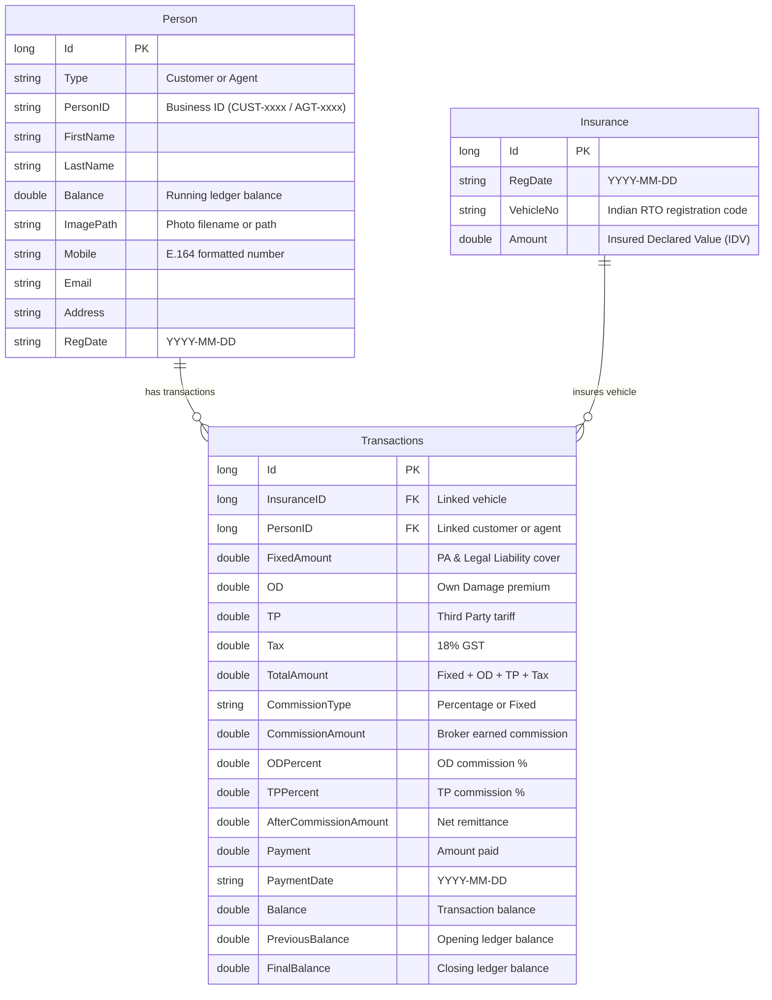

# EasyInsur 🛡️

A modern, high-performance **WPF desktop application** for managing motor insurance policies, agents, customers, commissions, and multi-party payment ledgers. Built with **.NET 10** using the **MVVM pattern with Prism**, styled with the **Syncfusion Fluent Light** design system and **HandyControls**, with local **SQLite** persistence via **RepoDb**.

---


## Key Features

- **Modern SaaS Navigation Sidebar** — Responsive collapsible sidebar (230px expanded / 68px compact) with active route lighting, official branding, operator status indicator, and keyboard shortcuts (`Ctrl+1` through `Ctrl+6`, `Ctrl+B` toggle).
- **Executive Dashboard** — Real-time KPI summary cards (Total Premium, Earned Commission, Ledger Balances, Active Customers, Agent Network), recent activity ledger feed powered by `SfDataGrid`, embedded `SfCalculator`, and quick portals (GIC, Parivahan, Vahan).
- **Person & Directory Management** — Comprehensive registration for Agents and Customers with international ISD phone code masking via `libphonenumber`, email validation, and opening balance controls.
- **Built-in Image Editor** — Integrated photo management card powered by Syncfusion `SfImageEditor` enabling cropping, rotation, adjustments, and instant preview before saving.
- **Instant Scannable QR Identity Cards** — High-contrast QR codes generated with `SfBarcode` encoding full person contact cards and ledger balances for quick scanning with mobile devices.
- **Vehicle & Policy Management** — Dedicated vehicle policy registry (`InsuranceWindow`) tracking Indian RTO registration codes, Insured Declared Values (IDVs), policy dates, and paginated records.
- **Actuarial Policy Calculation Engine** — Full calculation breakdown:
  - **Net Premium**: Fixed Amount (Owner-Driver PA / LL) + OD (Own Damage) + TP (Third Party tariff)
  - **Taxation**: 18% GST automatic computation
  - **Commissions**: Configurable percentage-based (OD% and TP%) or fixed brokerage fees
  - **Ledger Accounting**: Running balance tracking (`Previous Balance + Current Balance = Final Balance`) with unsaved change protection (`IConfirmNavigationRequest`).
- **High-Performance DataGrids & Pagination** — `SfSmartDataGrid` and `SfDataGrid` with multi-column sorting, grouping drop area, live filtering, column reordering, cell styling, and `SfDataPager` supporting 15, 25, 50, and 100 rows per page.
- **Enterprise Excel & PDF Export** — Asynchronous background `DataExportService` supporting Excel (`.xlsx`) with group outlining and PDF with custom page orientation, formatted styles, and page-fitting options.
- **Legally-Safe Synthetic Dataset Seeder** — Bundled `TestDataSeeder` CLI tool to generate realistic, RFC 2606-compliant mock datasets without exposing private personal data.

---
<details>
  <summary>Click to expand screenshots</summary>
  
</details>

---

## Tech Stack

| Layer | Technology | Details |
|---|---|---|
| **Framework** | .NET 10.0 (WPF) | C# Latest (`net10.0-windows`) |
| **Architecture** | MVVM with Prism 8.1 + DryIoc | ViewModel auto-wiring, region navigation, dialog abstraction |
| **UI Suite** | Syncfusion WPF v35.1.37 | `FluentLight` theme via `SfSkinManager` |
| **Grid & Tables** | Syncfusion `SfSmartDataGrid` & `SfDataGrid` | Virtualized data shaping, filtering, sorting, group-drop |
| **Pagination** | Syncfusion `SfDataPager` | Configurable numeric pagination with dynamic page sizes |
| **Form Controls** | Syncfusion WPF Controls | `ComboBoxAdv`, `DateTimeEdit`, `IntegerTextBox`, `CurrencyTextBox`, `SfMaskedEdit` |
| **Image Editing** | Syncfusion `SfImageEditor` | Crop, rotate, zoom, and enhance profile photos |
| **Barcode / QR** | Syncfusion `SfBarcode` | Quiet-zone optimized QR barcodes |
| **Calculator** | Syncfusion `SfCalculator` | Interactive desktop calculator |
| **Database & ORM** | SQLite + RepoDb.SqLite | Fast, lightweight local file database persistence |
| **Phone Formatting** | `libphonenumber-csharp` v8.12 | Global country ISD code and phone formatting |
| **Dialogs & Alerts** | `IAppDialogService` / HandyControls | Decoupled notification toasts and confirmation dialogs |
| **CI/CD** | GitHub Actions | Automated single-file executable packaging on version tags |

---

## Getting Started

### Prerequisites

- [.NET 10.0 SDK](https://dotnet.microsoft.com/download/dotnet/10.0)
- Windows 10 or Windows 11 (WPF requires Windows)
- A [Syncfusion license key](https://www.syncfusion.com/products/communitylicense) (free Community License available for individuals and small teams)

### Build & Run

1. **Clone the repository**

   ```bash
   git clone https://github.com/DineshSolanki/EasyInsur.git
   cd EasyInsur
   ```

2. **Restore dependencies**

   ```bash
   dotnet restore
   ```

3. **Run the application**

   ```bash
   dotnet run --project EasyInsur
   ```

   The SQLite database (`EasyInsur.db`) is included and configured automatically with foreign keys enabled.

### Seeding Demo Data

To populate or reset the database with synthetic, legally-safe demo records:

```bash
dotnet run --project TestDataSeeder -- "EasyInsur\EasyInsur.db"
```

### Publish a Single-File Release

```bash
dotnet publish ./EasyInsur -r win-x64 -p:PublishSingleFile=true --self-contained false -c Release -o ./publish
```

This compiles an optimized, single-file desktop executable for Windows x64.

---

## Application Architecture

```
EasyInsur/
├── EasyInsur/                             # Main WPF application project (.NET 10)
│   ├── images/                            # Local storage directory for profile photos
│   ├── Models/                            # Domain entities and data structures
│   │   ├── SearchControl/                 # In-grid Ctrl+F search adorner
│   │   ├── CellStyleSelector.cs           # Grid cell modification highlighter
│   │   ├── Country.cs                     # ISD country model with masks & examples
│   │   ├── EditableTableClass.cs          # Base model with change tracking
│   │   ├── Insurance.cs                   # Vehicle policy entity
│   │   ├── Person.cs                      # Customer / Agent entity
│   │   ├── PersonType.cs                  # Enum: Customer, Agent, Any
│   │   └── Transactions.cs                # Ledger transaction & commission entity
│   ├── Modules/                           # Business logic, services & converters
│   │   ├── AppConfig.cs                   # Global configuration & SQLite connection
│   │   ├── AppDialogService.cs            # Concrete dialog & notification service
│   │   ├── IAppDialogService.cs           # Dialog abstraction interface
│   │   ├── DataExportService.cs           # Asynchronous Excel & PDF export service
│   │   ├── DBMethods.cs                   # RepoDb + SQLite data access layer
│   │   ├── Util.cs                        # Financial rounding & utility functions
│   │   └── *Converter.cs                  # Value converters (image, color, visibility)
│   ├── ViewModels/                        # Prism MVVM ViewModels
│   │   ├── DashboardViewModel.cs          # Metrics, recent activities, calculators
│   │   ├── InsuranceWindowViewModel.cs    # Vehicle policy registration & pagination
│   │   ├── MainWindowViewModel.cs         # Shell navigation, hotkeys & sidebar state
│   │   ├── PaymentWindowViewModel.cs      # Policy premium & commission calculation
│   │   ├── PersonDetailsViewModel.cs      # Person registration & photo editing
│   │   ├── ViewPaymentWindowViewModel.cs  # Payment ledger directory & export
│   │   └── ViewPeopleWindowViewModel.cs   # Directory directory & export
│   ├── Views/                             # XAML Views & Dialogs
│   │   ├── Controls/
│   │   │   └── ModernNavItem.xaml         # Custom sidebar navigation button
│   │   ├── Dashboard.xaml                 # Executive analytics dashboard
│   │   ├── ImageEditorDialog.xaml         # Syncfusion SfImageEditor dialog window
│   │   ├── InsuranceWindow.xaml           # Vehicles & policies registry
│   │   ├── MainWindow.xaml                # App shell with collapsible sidebar
│   │   ├── PaymentWindow.xaml             # Policy calculation & transaction form
│   │   ├── PersonDetails.xaml             # Registration form with photo card
│   │   ├── ViewPaymentWindow.xaml         # Transaction history with data pager
│   │   └── ViewPeopleWindow.xaml          # Client/agent directory with details cards
│   ├── Resources/                         # Official logo, icons, ISD codes, PDFs
│   ├── App.xaml / App.xaml.cs             # Application entry, styles & Syncfusion init
│   ├── Services.cs                        # App runtime paths and settings
│   └── EasyInsur.db                       # SQLite database
├── TestDataSeeder/                        # Synthetic mock dataset seeder (.NET 10)
│   ├── Program.cs                         # RFC 2606-safe production seeder
│   └── TestDataSeeder.csproj
├── .github/workflows/
│   └── cd.yml                             # GitHub Actions CI/CD release workflow
└── EasyInsur.sln
```

---

## Data Model



---

## Keyboard Shortcuts

| Shortcut | Description |
|---|---|
| `Ctrl + 1` | Navigate to **Dashboard** |
| `Ctrl + 2` | Navigate to **New Payment Entry** |
| `Ctrl + 3` | Navigate to **Payment History** |
| `Ctrl + 4` | Navigate to **Register Person** |
| `Ctrl + 5` | Navigate to **People Directory** |
| `Ctrl + 6` | Navigate to **Vehicles & Policies** |
| `Ctrl + B` | **Toggle Sidebar** (Expand 230px / Collapse 68px) |
| `Ctrl + F` | Open **In-Grid Search Overlay** |

---

## CI/CD Workflow

The repository includes an automated [GitHub Actions release workflow](.github/workflows/cd.yml):

1. **Trigger**: Pushing a semantic version tag (e.g., `v1.2.0`).
2. **Build**: Restores and compiles with the .NET 10 SDK on `windows-latest`.
3. **Package**: Publishes a single-file executable and archives it into a ZIP distribution.
4. **Release**: Automatically drafts and attaches the binaries to the GitHub Release.

---

## License

This project is licensed under the terms described in the [LICENSE](LICENSE) file.

---

## Author

**Dinesh Solanki** — [GitHub](https://github.com/DineshSolanki) · [Blog](https://dineshsolanki.com)
