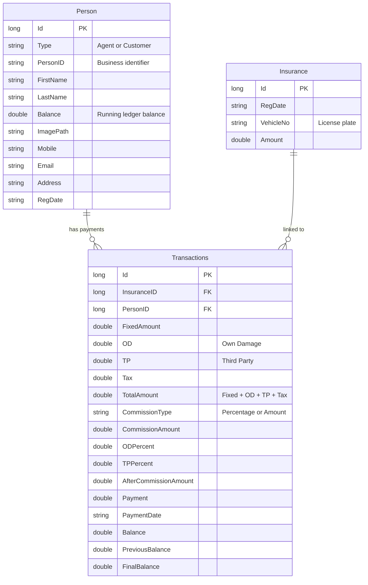

# EasyInsur 🛡️

A **WPF desktop application** for managing motor insurance policies, agents, customers, commissions, and payment ledgers. Built with **.NET 5** using the **MVVM pattern with Prism**, featuring rich UI components from **Syncfusion** and **HandyControls**, with local **SQLite** data persistence via **RepoDb**.

---


## Features

- **Dashboard** — Real-time summary cards showing customer/agent counts, quick links to insurance portals (GIC, Parivahan, Vahan), embedded calculator, and RTO code reference
- **Person Management** — Register agents and customers with international phone formatting, photo uploads, QR code identity cards, and balance tracking
- **Policy & Transaction Management** — Calculate insurance breakdowns (Fixed + OD + TP + Tax), compute agent commissions (percentage or fixed), and maintain running ledger balances
- **In-Grid Editing** — Edit records directly in paginated, sortable, filterable data grids with visual change tracking
- **Export** — Export grids to Excel (`.xls` / `.xlsx`) and PDF with stacked headers, auto-filters, and configurable orientation
- **Search** — Custom Ctrl+F search overlay with Find Next / Find Previous navigation inside data grids
- **QR Code Generation** — Generate QR codes encoding person details (name, mobile, email, balance)

---

## Tech Stack

| Layer | Technology |
|---|---|
| Framework | .NET 5.0 (WPF) |
| Architecture | MVVM with Prism + DryIoc |
| UI Controls | Syncfusion WPF 20.2 (DataGrid, Calculator, Barcode, Image Editor) |
| UI Styling | HandyControls 3.3 (SideMenu, Masked Inputs, Fluent Light theme) |
| Database | SQLite (local file) |
| ORM | RepoDb.SqLite |
| Phone Formatting | libphonenumber-csharp |
| JSON | Newtonsoft.Json |
| CI/CD | GitHub Actions (single-file publish → GitHub Releases) |

---

## Getting Started

### Prerequisites

- [.NET 5.0 SDK](https://dotnet.microsoft.com/download/dotnet/5.0)
- Windows 10+ (WPF requires Windows)
- A valid [Syncfusion license key](https://www.syncfusion.com/products/communitylicense) (community license is free for individuals and small businesses)

### Build & Run

1. **Clone the repository**

   ```bash
   git clone https://github.com/DineshSolanki/EasyInsur.git
   cd EasyInsur
   ```

2. **Restore dependencies**

   ```bash
   dotnet restore
   ```

3. **Run the application**

   ```bash
   dotnet run --project EasyInsur
   ```

   The SQLite database (`EasyInsur.db`) is bundled with the project and will be used automatically.

### Publish a Release Build

```bash
dotnet publish ./EasyInsur -r win-x64 -p:PublishSingleFile=true --self-contained false -c Release -o ./publish
```

This produces a single-file executable for Windows x64.

---

## Application Screens

### 1. Dashboard
Summary cards with aggregate counts, useful insurance portal links, integrated calculator, and developer credits.

### 2. Person Details
Register agents and customers with:
- Country ISD code selection with dynamic phone masks
- Profile photo upload
- Opening balance entry
- QR code identity card preview

### 3. View People
Paginated `SfDataGrid` with filtering, sorting, in-cell editing, batch save, and Excel/PDF export. Context menu to jump directly to payment entry.

### 4. Payment Window
Full policy calculation engine:
- **Insurance breakdown**: Fixed Amount + OD (Own Damage) + TP (Third Party) + Tax = Total
- **Commission**: Fixed amount or percentage-based on OD and TP components
- **Ledger**: Previous Balance + Current Balance = Final Balance

### 5. View Payments
Transaction history grid filtered by person type (Agent/Customer/Any) or specific payee, with stacked-header Excel and PDF export.

---

## Project Structure

```
EasyInsur/
├── EasyInsur/                         # Main WPF application
│   ├── images/                        # Local storage for profile photos
│   ├── Models/
│   │   ├── SearchControl/             # Custom Ctrl+F search adorner for SfDataGrid
│   │   ├── CellStyleSelector.cs       # Highlights modified grid cells
│   │   ├── Country.cs                 # ISD country model with phone mask formatting
│   │   ├── EditableTableClass.cs      # Base IEditableObject with change tracking
│   │   ├── Insurance.cs               # Insurance policy record
│   │   ├── Person.cs                  # Agent / Customer entity
│   │   ├── PersonType.cs              # Enum: Agent, Customer, Any
│   │   └── Transactions.cs            # Ledger transaction & commission model
│   ├── Modules/
│   │   ├── AppConfig.cs               # Global config & SQLite connection string
│   │   ├── DBMethods.cs               # Data access layer (RepoDb + SQLite)
│   │   ├── Util.cs                    # Utility routines (phone masking, etc.)
│   │   └── *Converter.cs              # Value converters (color, visibility, image)
│   ├── ViewModels/                    # Prism MVVM ViewModels (BindableBase)
│   │   ├── DashboardViewModel.cs
│   │   ├── InsuranceWindowViewModel.cs
│   │   ├── MainWindowViewModel.cs
│   │   ├── PaymentWindowViewModel.cs
│   │   ├── PersonDetailsViewModel.cs
│   │   ├── ViewPaymentWindowViewModel.cs
│   │   └── ViewPeopleWindowViewModel.cs
│   ├── Views/                         # XAML views with code-behind
│   │   ├── Dashboard.xaml
│   │   ├── InsuranceWindow.xaml
│   │   ├── MainWindow.xaml            # Shell with HandyControl SideMenu
│   │   ├── PaymentWindow.xaml
│   │   ├── PersonDetails.xaml
│   │   ├── ViewPaymentWindow.xaml
│   │   └── ViewPeopleWindow.xaml
│   ├── Resources/                     # Icons, images, ISD codes JSON, RTO list PDF
│   ├── App.xaml / App.xaml.cs         # PrismApplication bootstrap & Syncfusion init
│   ├── Services.cs                    # App-level services (paths, settings)
│   ├── EasyInsur.csproj
│   └── EasyInsur.db                   # SQLite database
├── .github/workflows/
│   └── cd.yml                         # GitHub Actions: tag → build → GitHub Release
├── .editorconfig
└── EasyInsur.sln
```

---

## Data Model



---

## CI/CD

The project includes a [GitHub Actions workflow](.github/workflows/cd.yml) that:

1. Triggers on version tag pushes (`v*`)
2. Builds a single-file `win-x64` executable
3. Packages into a ZIP archive (`EasyInsur-<tag>-win-x64.zip`)
4. Publishes as a GitHub Release

---

## License

This project is open source. See the [LICENSE](LICENSE) file for details.

---

## Author

**Dinesh Solanki** — [Blog](https://dineshsolanki.com) · [GitHub](https://github.com/DineshSolanki)
